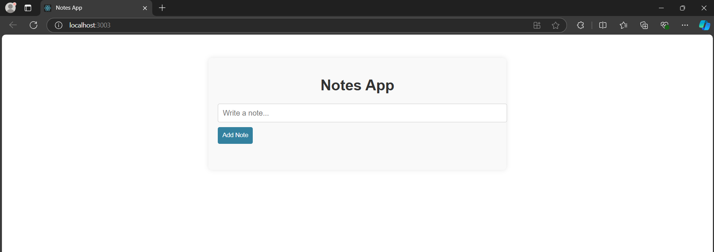
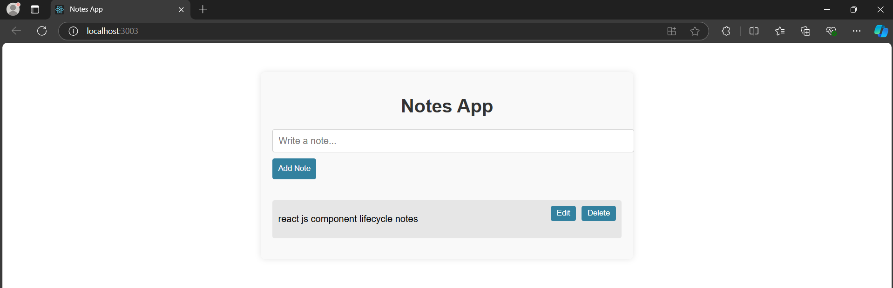

# Notes-App
A simple Notes App built with React that allows users to add, edit, and delete notes. This app is useful for keeping track of to-dos, ideas, reminders, and other short notes.
# Features
  - Add New Notes: Users can add new notes with a simple input field.
  - Edit Notes: Users can update existing notes.
  - Delete Notes: Users can remove notes they no longer need.
# Screenshots

     &nbsp;&nbsp; 
     

